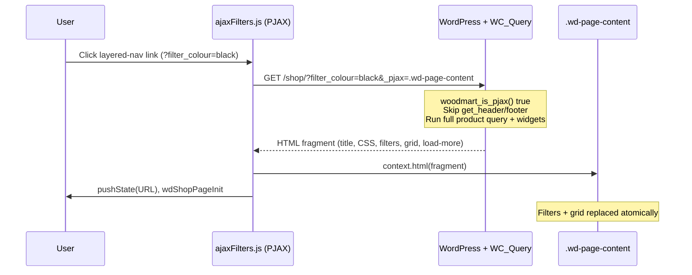

# 12A — Woodmart AJAX Shop Filtering (PJAX) — How It Actually Works

**Read this after file `12`.** File `12` documents the *filter widgets themselves*
(native WooCommerce layered nav + swatch markup). This file documents the *transport
layer* — why filtering on `chairforce.test` feels instant, why the filter sidebar
updates in sync with the product grid, and what that implies for the Chairforce
rebuild.

**Verified against:** live reference site `chairforce.test` (Woodmart 8.x, `ajax_shop:
1`, body class `woodmart-ajax-shop-on`) and theme source at
`~/Projects/wp/chairforce/wp-content/themes/woodmart/`.

---

## Executive summary

Woodmart does **not** use a custom REST “facet API” or Jet/WPGB for shop filtering.
When AJAX shop is enabled, it uses **jQuery PJAX** (partial page load):

1. User clicks a filter link (or sort link, pagination link, price-filter submit).
2. Browser sends a **normal GET** to that URL with `?_pjax=.wd-page-content` and
   `X-Requested-With: XMLHttpRequest`.
3. WordPress runs a **full server-side archive request** with the new query string
   (`filter_colour=black`, `min_price`, `orderby`, etc.).
4. Server skips header/footer and returns an **HTML fragment** (~160KB on `/shop/`):
   `<title>`, inline CSS, then the entire shop content region — **including filter
   widgets, active-filter chips, result count, product grid page 1, and load-more
   button**.
5. JS replaces the **inner HTML of `.wd-page-content`** and updates the address bar
   via `history.pushState`.
6. A `wdShopPageInit` event re-initializes all shop scripts (filters drawer, load
   more, swatches, sort widget, price slider).

**That is why filters and products never drift:** both are rendered by the same PHP
request against the same `WP_Query`. Facet counts come from WooCommerce’s native
`Filterer` at render time — not from a second client-side sync step.

It is **not** a full document reload (no header/footer flash), but it **is** a
server re-render of the whole shop shell — closer to “fast partial reload” than
“REST micro-fragments”.

---

## Architecture diagram



---

## Two separate AJAX channels (do not conflate them)

Woodmart uses **two different mechanisms** on the same shop page:

| Action | Mechanism | Request | Response | What updates |
|---|---|---|---|---|
| **Filter / sort / clear / archive pagination (page 1)** | **PJAX** | GET filter URL + `_pjax=.wd-page-content` | HTML fragment | Entire `.wd-page-content` inner HTML |
| **Load More (page 2+)** | **`woo_ajax` fragments** | GET next page URL + `woo_ajax=1` (+ `loop`) | JSON `{ items, nextPage, status, … }` | Product cards **appended** only |

Filter changes **reset to page 1 via PJAX** (grid + filters + load-more button all
fresh). Load More **does not** re-fetch filter widgets — it only appends products
using the current URL’s filter context.

Source references:

- PJAX wiring: `js/scripts/wc/ajaxFilters.js`
- Load More append: `js/scripts/wc/productsLoadMore.js` (`source === 'main_loop'` → GET)
- Fragment JSON: `inc/integrations/woocommerce/functions.php` →
  `woodmart_woocommerce_main_loop( true )` + `archive-product.php` early exit when
  `woo_ajax === 'fragments'`

---

## Client-side: what triggers PJAX

### Theme setting

- **Theme Settings → Shop → AJAX shop** → option `ajax_shop` (live site: **on**).
- Adds body class `woodmart-ajax-shop-on`.
- Enqueues `js/libs/pjax.js` on shop archives (`inc/enqueue.php`).

### Intercepted link selectors

Registered in `woodmart_settings.ajax_links` (`inc/enqueue.php`, filterable via
`woodmart_ajax_links`). Includes:

- `.woocommerce-widget-layered-nav a`
- `.woodmart-woocommerce-layered-nav a`
- `.widget_layered_nav_filters a`
- `.wd-clear-filters a`
- `.woodmart-price-filter a`
- `.woocommerce-pagination a` (archive pagination)
- `.woodmart-woocommerce-sort-by a`
- `.filters-area:not(.custom-content) a`
- …and several shop-tool links (per-page, grid view, category nav, brands, stock)

Core binding (`ajaxFilters.js`):

```js
woodmartThemeModule.$document.pjax(
  woodmart_settings.ajax_links,
  '.wd-page-content',
  { timeout, scrollTo: false, renderCallback: … }
);
```

Filter links are plain `<a href="?filter_pa_colour=slug">` anchors. PJAX prevents
default navigation and fetches the href instead.

### PJAX request shape (live verification)

```bash
curl -sk "https://chairforce.test/shop/?filter_colour=black&_pjax=.wd-page-content" \
  -H "X-Requested-With: XMLHttpRequest"
```

Response starts with `<title>Shop - …</title>` and inline CSS, then `<main
id="main-content" …>` — **not** a full `<html>` document (~161KB on `/shop/`).

The `_pjax` query param value (`.wd-page-content`) tells the server which container
the client will replace; jquery-pjax appends it automatically (`js/libs/pjax.js`).

---

## Server-side: how the fragment is built

### Detection

`woodmart_is_pjax()` (`inc/integrations/woocommerce/helpers.php`):

- `$_REQUEST['_pjax']` is set, **and**
- `X-Requested-With: XMLHttpRequest`

Also grouped under `woodmart_is_woo_ajax()` (returns boolean `true` for PJAX).

### Template path (default shop archive)

`woocommerce/archive-product.php`:

| Normal page load | PJAX request |
|---|---|
| `get_header( 'shop' )` | **skipped** |
| `woodmart_page_top_part()` → opens `<div class="wd-page-content">` | **skipped** — outputs `<title>` + `woodmart_pjax_top_part` inline CSS only |
| Sidebar, shop tools, **filters area**, product loop, pagination/load-more | **rendered** |
| `get_footer( 'shop' )` | **skipped** — `woodmart_page_bottom_part()` closes `</main>` only |

`woodmart_page_top_part()` / `woodmart_page_bottom_part()`:
`inc/template-tags/template-tags.php`.

### What is inside the replaced region

Everything between the opening `.wd-page-content` wrapper (initial SSR) and its
close — on PJAX, the **fragment replaces `.wd-page-content`’s innerHTML**, which
includes:

1. **Shop loop head** — breadcrumbs, result count, catalog ordering
2. **`woodmart_shop_filters_area`** — the collapsible filters drawer/panel
   (`filters-area` sidebar widget area with all `WOODMART_Widget_Layered_Nav`
   instances, price filter, etc.)
3. **Active filters** — chips / clear row (`woodmart_get_active_filters`)
4. **Product grid** — page 1 only (`woodmart_woocommerce_main_loop`)
5. **Load More button** / pagination footer
6. **Sidebar** (when layout is sidebar-left/right) — also re-rendered if inside the
   content flow

Because **filter widgets are PHP-rendered in the same request as the product
loop**, WooCommerce’s `Filterer` sees the current `filter_*` params + archive
context and outputs updated term counts and hides zero-count terms automatically.
No second API call, no client-side count recompute.

---

## Client-side: after the swap

### Replacement

`renderCallback` in `ajaxFilters.js`:

1. `removeDuplicatedStylesFromHTML()` — strips duplicate `<link>`/`<style>` tags
   from the fragment before injection (avoids CSS bloat on repeated filters).
2. `context.html(html)` — replace `.wd-page-content` contents.
3. `wdShopPageInit` — re-bind shop modules.
4. `wood-images-loaded` — lazy-load images in new markup.

### URL + history

- jquery-pjax calls `history.pushState` on success (filter URL becomes bookmarkable).
- `popstate` listener triggers `wdShopPageInit` so Back/Forward re-syncs UI without
  a full reload (browser restores prior DOM snapshot from PJAX cache when possible).

### Loading UX

- `pjax:start` → `.wd-content-layout` gets `wd-loading`
- `pjax:complete` / `wdShopPageInit` → `wd-loaded`, optional scroll-to-shop-top

### Keeping the filters drawer open (the “one problem” Woodmart already solved)

When `shop_filters_close === 'yes'` (live default: close drawer on filter — but the
**re-open after PJAX** path exists for the opposite setting):

`ajaxFilters.js`:

```js
// pjax:beforeReplace — remember drawer was open
if ($('.filters-area').hasClass('filters-opened') && shop_filters_close === 'yes') {
  filtersState = true;
  $('body').addClass('body-filters-opened');
}

// wdShopPageInit — restore drawer after new HTML is in place
if (filtersState) {
  $('.filters-area').css('display', 'block');
  woodmartThemeModule.openFilters(200);
  filtersState = false;
}
```

`filtersArea.js` handles `.open-filters` toggle (`slideDown` / `filters-opened`
class). After PJAX, the drawer DOM is **brand new** — state is restored from JS
memory, not from preserving DOM nodes.

If `shop_filters_close === 'no'`, clicking a filter link **closes** the drawer
instead (opposite UX).

---

## Why it feels “too smooth to be a reload”

| Perception | Reality |
|---|---|
| “Maybe PJAX?” | **Yes** — jquery-pjax partial load |
| “Sidebar updates perfectly” | Sidebar/filter widgets are **in the same HTML fragment** as the grid |
| “Counts feel instant” | Server-rendered `Filterer` counts in one pass; no REST round-trip for facets |
| “No page flash” | Header, footer, cart drawer, mega menu **never re-render** |
| “URL still updates” | `pushState` keeps shareable/bookmarkable filter URLs |
| “Load More still works” | Separate `woo_ajax` JSON append; PJAX resets page 1 when filters change |

---

## Comparison: Woodmart PJAX vs Chairforce 2026 REST fragments (Phase 3f)

Current rebuild approach (`chairforce/v1/load-more?mode=replace`):

| Aspect | Woodmart PJAX | Chairforce REST (implemented) |
|---|---|---|
| Transport | GET → HTML fragment | GET → JSON with multiple HTML strings |
| Server render | One archive template pass | Custom REST builds grid + chips + panel separately |
| Filter/grid sync | **Impossible to drift** (single query) | Must manually keep sort, tax_query, counts aligned |
| Facet counts | Free (widget PHP) | Must explicitly re-render `panelHtml` |
| Drawer open | Solved (`filtersState` + re-open) | Must solve separately (`is-open` on panel) |
| Load More | Separate append channel (same as Woodmart pattern) | Same idea (`mode=append`) — compatible |
| FSE/block theme fit | Woodmart owns `archive-product.php` | Block templates need a deliberate “archive shell” partial |

**Observed pain in the REST approach** (already hit in implementation):

- Sort order mismatch between SSR grid, `data-query-vars`, and URL → duplicate
  products on Load More (fixed with extra stripping logic — symptom of dual sources
  of truth).
- Re-applying `filter_*` on top of replayed `query_vars` → duplicate `tax_query`.
- Panel HTML swap vs drawer animation / focus state → extra JS edge cases.

Woodmart avoids most of this by **never splitting the archive into competing
fragments** for filter operations.

---

## Rebuild recommendation (architecture, not UI)

**Match Woodmart’s contract, not necessarily its jQuery library.**

### Preferred direction: “archive shell partial reload”

For filter/sort/clear/page-1 pagination:

1. Keep **URL query params as source of truth** (`filter_*`, `min_price`, `orderby`)
   — same as today and as Woodmart.
2. On interaction, `fetch()` the **current archive URL** (or a thin theme endpoint
   that accepts the same query string) and return **one HTML blob** for a defined
   wrapper, e.g. `.cf-shop-archive-shell`, containing:
   - filter bar + panel (or drawer)
   - active filter chips
   - results count
   - product collection (page 1)
   - load-more markup
3. `innerHTML` swap + `dispatchContentUpdated()` + preserve drawer open state in JS.
4. `history.pushState` / `popstate` re-fetch the same shell (Woodmart parity).

Implementation options (all valid):

- **A. PJAX-style GET fragment** — PHP detects `X-Requested-With` + `_chairforce_pjax`
  (or `Accept: text/html; fragment=…`) and renders a partial without header/footer.
  Closest to Woodmart; works with existing PHP partials.
- **B. REST returning one `html` field** — still one server render internally; simpler
  client than four separate fragments. Collapse current `mode=replace` extras into a
  single `shellHtml` from one `ob_start()` partial include.
- **C. Full navigation** — correct but rejected for UX (multi-filter sessions).

**Keep Load More as append** (Woodmart’s `woo_ajax` pattern) — already aligned with
`mode=append`. Filter changes should reset page 1 via the shell reload, not append.

### What NOT to do

- Do **not** maintain separate code paths that build the grid in REST and the filter
  panel in REST with different query assembly — that fights WooCommerce’s natural
  “one archive query” model and reproduces the bugs already seen.
- Do **not** assume Jet Smart Filters or WPGB — live site confirmed native only
  (file `12`).

---

## Key source files (Woodmart theme)

| File | Role |
|---|---|
| `inc/admin/settings/product-archive.php` | `ajax_shop` setting |
| `inc/enqueue.php` | PJAX enqueue, `ajax_links`, `woodmart_settings` |
| `js/libs/pjax.js` | jquery-pjax |
| `js/scripts/wc/ajaxFilters.js` | Shop PJAX bind, loading UI, drawer restore |
| `js/scripts/wc/filtersArea.js` | Filters drawer open/close |
| `js/scripts/wc/productFilters.js` | Horizontal “product filters” form PJAX |
| `js/scripts/wc/sortByWidget.js` | Orderby `<select>` PJAX |
| `js/scripts/wc/filterDropdowns.js` | Dropdown filter PJAX |
| `js/scripts/wc/productsLoadMore.js` | Load More append (`woo_ajax`) |
| `inc/integrations/woocommerce/helpers.php` | `woodmart_is_pjax()`, `woodmart_is_woo_ajax()` |
| `inc/template-tags/template-tags.php` | `woodmart_page_top_part()` PJAX branch |
| `woocommerce/archive-product.php` | Archive layout; fragment vs full page |
| `inc/integrations/woocommerce/functions.php` | `woodmart_woocommerce_main_loop()`, active filters |
| `inc/integrations/woocommerce/template-tags.php` | `woodmart_shop_filters_area()` |
| `inc/widgets/class-widget-layered-nav.php` | Filter widget markup + `Filterer` counts |

---

## Related docs

- `12-shop-archive-filters.md` — widget data model and WC filter params
- `17-load-more-and-event-delegation.md` — `wdShopPageInit` / delegated events after AJAX
- `context/notes/product-filters-findings.md` §6 — rebuild planning (update after pivot decision)
- `context/plans/3f-product-filters-plan.md` — Phase 3f implementation plan
